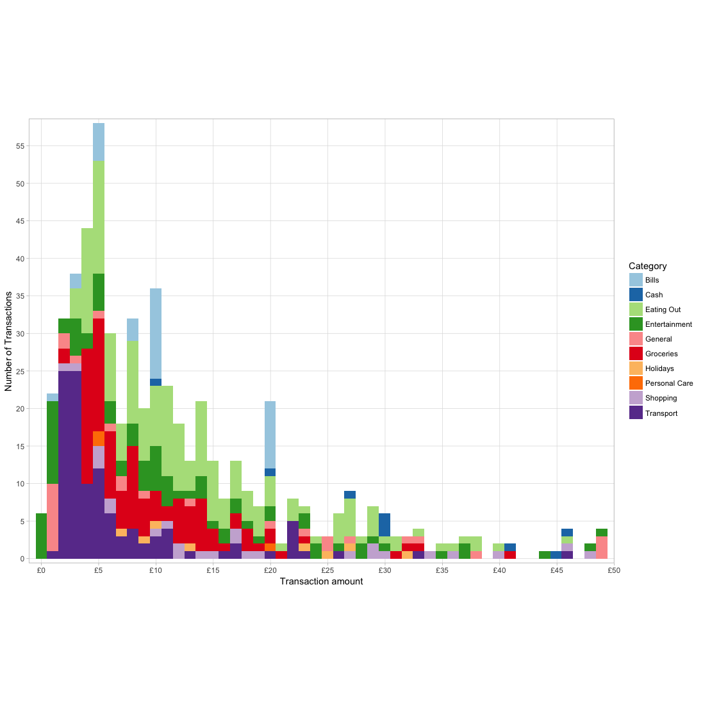

# Monzor

`Monzor` wraps the R API in an easy-to-use, convenient R package. It makes Monzo's banking API accessible to R's data manipulation and visualisation powers.  

# Examples

With it you can do things like visualise your spending geographically, examine trends across spending categories, merge it with any number of other data sources, or simply make really pretty data visualisations. 

| Heatmap | Histogram |  
:-------------------------:|:-------------------------:
   |   
  
